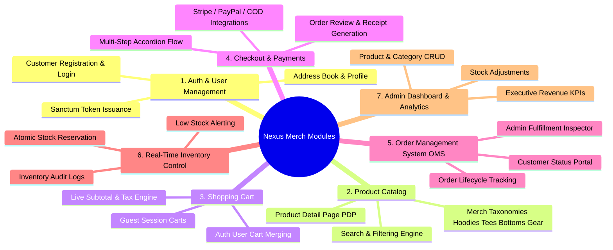

# PROJECT.md - NexusCommerce MVP Architecture & Engineering Guide

This document serves as the definitive reference for onboarding developers, AI coding assistants, and system architects working on **NexusCommerce MVP (Official Merch Studio)**. It answers the six foundational questions regarding the platform's architecture, conventions, and module structure.

---

## Table of Contents
1. [What is this project?](#1-what-is-this-project)
2. [What technologies are used?](#2-what-technologies-are-used)
3. [What are the main modules?](#3-what-are-the-main-modules)
4. [Where does each feature live? (Frontend Folder Structure)](#4-where-does-each-feature-live)
5. [What are the coding conventions?](#5-what-are-the-coding-conventions)
6. [What are the important architectural rules?](#6-what-are-the-important-architectural-rules)

---

## 1. What is this project?

**NexusCommerce MVP (Official Merch Studio)** is a modern, decoupled full-stack e-commerce web application engineered to deliver a responsive, editorial retail shopping experience for a premium creator merchandise brand (specializing in 400 GSM heavyweight hoodies, boxy combed cotton tees, utility cargo joggers, and aerospace titanium accessories) while providing comprehensive real-time store management capabilities for administrators.

### Core Objectives & Design Philosophy
* **Nordic Minimalist Editorial UI/UX**: Built with a clean Scandinavian editorial approach (Option C: Indigo & Coral). Enforces **zero marketplace clutter, zero emojis, zero 3D tilting gimmicks, and zero AI-slop glassmorphism**. Emphasizes immaculate whitespace (`#FDF8F6` and `#FFFFFF`), high-contrast uppercase typography (`Outfit` and `Inter`), 1px slate borders, and mono-spaced pricing.
* **Customer-Facing Experience**: Fast, frictionless browsing of dynamic merchandise catalogs, SEO-optimized product detail pages via Next.js Server Components, seamless shopping cart manipulation, multi-step accordion checkout, and order tracking.
* **Administrative Operations**: Real-time KPI monitoring, inventory auditing, product/category management, and lifecycle order fulfillment.
* **Architectural Integrity**: Built with strict separation of concerns between a **Next.js 16 (App Router)** frontend and a stateless **Laravel 11/12 RESTful backend API** governed by PostgreSQL relational and JSONB storage patterns.

---

## 2. What technologies are used?

### Frontend Stack (Next.js App Router)
* **Next.js 16**: Modern full-stack React framework utilizing the App Router (`app/` directory), React Server Components (RSC) for superior SEO and initial load speed, and Client Components for rich interactive UI.
* **React 19**: Core component framework leveraging modern concurrency and Server Action primitives.
* **TypeScript 5+**: Enforces end-to-end compile-time type safety across UI components, API fetchers, and state stores.
* **Tailwind CSS v4**: Utility-first CSS framework configured with Option C (Nordic Minimalist Editorial Indigo & Coral) design tokens, clean 1px borders, and responsive layouts.
* **Zustand & TanStack Query v5**: Combined client-side state management for optimistic cart updates, deduplicated API fetching, and persistent storage, working alongside Next.js native server-side caching.
* **Lucide React & React Hook Form + Zod**: Accessible vector iconography and schema-driven client-side form validation.

### Backend Stack (API Gateway & Core)
* **Laravel 11/12 (PHP 8.3+)**: Dedicated REST API backend architecture.
* **Laravel Sanctum**: Lightweight, state-aware API token management and stateless Bearer token authentication.
* **Eloquent ORM**: Data abstraction layer configured with Strict Mode enabled (`shouldBeStrict()`) to prevent lazy loading N+1 queries and silent attribute mutations.
* **Queue Workers**: Asynchronous task workers processing email confirmations, invoice generation, and payment gateway webhook events.

### Database & Infrastructure
* **PostgreSQL 16+**: Primary relational data store utilizing UUID keys, relational foreign constraints, atomic transaction locking, and high-frequency `JSONB` document storage.
* **Redis 7+**: In-memory caching engine handling session locking, API rate-limiting, and high-frequency catalog read caching.

---

## 3. What are the main modules?

The system is organized into seven distinct functional domain modules:



1. **Authentication & User Management Module**: Handles secure customer onboarding, credentials verification, Sanctum token lifecycle, password recovery, and multi-address book management (`addresses`).
2. **Product Catalog & Category Taxonomy Module**: Manages hierarchical merch taxonomies (*Hoodies & Outerwear*, *Tees & Tops*, *Bottoms & Joggers*, *Bracelets & Gear*), product listings, image galleries (`product_images`), pricing tiers, and dynamic query filtering.
3. **Shopping Cart Module**: Operates dual-state guest/authenticated shopping carts (`carts`, `cart_items`) with real-time price, tax, and shipping calculations.
4. **Checkout & Payment Processing Module**: Orchestrates order creation (`orders`, `order_items`), captures immutable address snapshots, and integrates payment providers (`payments`).
5. **Order Management System (OMS) Module**: Tracks customer order fulfillment stages (`pending` -> `processing` -> `shipped` -> `delivered` -> `cancelled`).
6. **Real-Time Inventory Control Module**: Manages stock quantities (`inventory_items`), prevents concurrent overselling via database row locking, and maintains an immutable audit trail (`inventory_logs`).
7. **Admin Dashboard & Analytics Module**: Provides executive analytics, low-stock notifications, and administrative CRUD interfaces for store catalog management.

---

## 4. Where does each feature live?

The repository is structured as a monorepo containing dedicated `frontend/e-commerce-frontend/` and `backend/e-commerce-backend/` directories.

### 4.1 Definitive Frontend Folder Structure (`frontend/e-commerce-frontend/`)
To systematically continue with our system flow (Cart -> Checkout -> User Portal -> Admin Dashboard -> Backend Integration), the frontend codebase strictly adheres to the following modular structure:

```text
frontend/e-commerce-frontend/
├── app/                                      # Next.js 16 App Router Structure
│   ├── (auth)/                               # Route Group: Authentication Workflows
│   │   ├── login/page.tsx                    # Customer login screen (Sanctum JWT/Cookie)
│   │   ├── register/page.tsx                 # New customer onboarding & account creation
│   │   └── forgot-password/page.tsx          # Password reset trigger
│   ├── (shop)/                               # Route Group: Storefront & E-Commerce Flow
│   │   ├── catalog/                          # Full merchandise catalog with filter sidebar
│   │   │   └── page.tsx                      # Paginated catalog view
│   │   ├── products/                         # Product Detail Pages (PDP)
│   │   │   └── [slug]/page.tsx               # Server-rendered PDP with image gallery & specs
│   │   ├── cart/                             # Dedicated shopping cart page
│   │   │   └── page.tsx                      # Full cart view, coupon code, and tax estimate
│   │   ├── checkout/                         # Checkout & Payment Pipeline
│   │   │   ├── page.tsx                      # Multi-step accordion checkout (Address -> Shipping -> Pay)
│   │   │   └── success/page.tsx              # Order confirmation receipt & tracking summary
│   │   ├── orders/                           # Customer Order History & Tracking
│   │   │   ├── page.tsx                      # List of past orders with status badges
│   │   │   └── [orderNumber]/page.tsx        # Detailed order breakdown & shipment tracking
│   │   └── profile/                          # Customer Account Management
│   │       ├── page.tsx                      # Personal info & communication preferences
│   │       └── addresses/page.tsx            # CRUD address book (Shipping/Billing)
│   ├── admin/                                # Route Group: Protected Admin Management Portal
│   │   ├── layout.tsx                        # Admin sidebar navigation & RBAC guard
│   │   ├── page.tsx                          # Executive KPI dashboard (Revenue, Orders, Low Stock)
│   │   ├── products/                         # Merch catalog CRUD management
│   │   │   ├── page.tsx                      # Product list table with stock indicators
│   │   │   ├── new/page.tsx                  # Create new merchandise drop form
│   │   │   └── [id]/edit/page.tsx            # Edit existing product metadata & pricing
│   │   ├── categories/page.tsx               # Taxonomy hierarchy management
│   │   └── orders/                           # Order Management System (OMS)
│   │       ├── page.tsx                      # System-wide order fulfillment table
│   │       └── [id]/page.tsx                 # Admin order inspector & status updater
│   ├── globals.css                           # Tailwind CSS v4 imports & Option C editorial tokens
│   ├── layout.tsx                            # Root Server Layout (Fonts, Metadata, QueryProviders)
│   ├── page.tsx                              # Editorial Merch Landing Page (Hero, Catalog, Box Set)
│   └── not-found.tsx                         # 404 Not Found fallback
├── components/                               # Reusable Modular UI Components
│   ├── admin/                                # Admin-specific UI widgets (KPI Cards, Tables, Forms)
│   ├── cart/                                 # CartDrawer modal & CartItem row components
│   ├── catalog/                              # ProductCard, FilterSidebar, SortDropdown, SearchModal
│   ├── checkout/                             # AddressSelector, PaymentMethods, OrderSummaryBox
│   ├── layout/                               # Navbar, Footer, AnnouncementBar, MobileMenu
│   └── ui/                                   # Primitive UI building blocks (Button, Input, Badge, Modal)
├── lib/                                      # Core Infrastructure, API Clients & Utilities
│   ├── api/                                  # Axios / Fetch HTTP API Clients communicating with Laravel
│   │   ├── client.ts                         # Base API client with Sanctum interceptors & error handling
│   │   ├── auth.ts                           # Login, register, logout, and profile API calls
│   │   ├── products.ts                       # Catalog, category, and PDP data fetchers
│   │   ├── cart.ts                           # Server/client cart synchronization endpoints
│   │   ├── checkout.ts                       # Order submission & payment intent triggers
│   │   └── admin.ts                          # Admin KPI, product CRUD, and order status updates
│   ├── utils/                                # Helper functions (currency formatter, date formatting, cn)
│   └── validations/                          # Zod schema definitions for frontend form validation
├── store/                                    # Zustand Client-Side State Stores
│   ├── useAuthStore.ts                       # Authenticated user session, Sanctum token, and RBAC role
│   ├── useCartStore.ts                       # Cart items, quantity toggles, subtotal calculation, and drawer toggle
│   └── useUIStore.ts                         # Global UI state (mobile menu, search modal, toast alerts)
└── types/                                    # TypeScript Interfaces Matching Laravel API Payloads
    ├── auth.ts                               # User, Address, LoginResponse interfaces
    ├── product.ts                            # Product, Category, ProductImage, Spec interfaces
    ├── cart.ts                               # Cart, CartItem, CartSummary interfaces
    ├── order.ts                              # Order, OrderItem, Payment, ShippingAddress interfaces
    └── admin.ts                              # KPIMetrics, InventoryLog, StockAdjustment interfaces
```

### 4.2 Feature-to-File Location Matrix

| Feature / Domain | Frontend UI & Routes (`frontend/e-commerce-frontend/`) | Frontend State & Services | Backend Controllers (`backend/e-commerce-backend/app/`) | Backend Models & Services |
| :--- | :--- | :--- | :--- | :--- |
| **User Authentication & Profile** | `app/(auth)/login/page.tsx`<br>`app/(auth)/register/page.tsx`<br>`app/(shop)/profile/page.tsx` | `store/useAuthStore.ts`<br>`lib/api/auth.ts` | `Http/Controllers/Api/V1/AuthController.php`<br>`Http/Controllers/Api/V1/ProfileController.php` | `Models/User.php`<br>`Models/Address.php` |
| **Catalog & Product Browsing** | `app/(shop)/catalog/page.tsx`<br>`app/(shop)/products/[slug]/page.tsx`<br>`components/catalog/ProductCard.tsx` | `lib/api/products.ts`<br>`types/product.ts` | `Http/Controllers/Api/V1/ProductController.php`<br>`Http/Controllers/Api/V1/CategoryController.php` | `Models/Product.php`<br>`Models/Category.php`<br>`Models/ProductImage.php` |
| **Shopping Cart Operations** | `components/cart/CartDrawer.tsx`<br>`app/(shop)/cart/page.tsx` | `store/useCartStore.ts`<br>`lib/api/cart.ts` | `Http/Controllers/Api/V1/CartController.php` | `Models/Cart.php`<br>`Models/CartItem.php`<br>`Services/CartService.php` |
| **Checkout & Payments Flow** | `app/(shop)/checkout/page.tsx`<br>`app/(shop)/checkout/success/page.tsx` | `lib/api/checkout.ts`<br>`types/order.ts` | `Http/Controllers/Api/V1/CheckoutController.php` | `Models/Order.php`<br>`Models/Payment.php`<br>`Services/CheckoutService.php` |
| **Order History & OMS** | `app/(shop)/orders/page.tsx`<br>`app/(shop)/orders/[orderNumber]/page.tsx` | `lib/api/orders.ts` | `Http/Controllers/Api/V1/OrderController.php` | `Models/Order.php`<br>`Models/OrderItem.php` |
| **Inventory Management** | Displayed via stock badges on `ProductCard.tsx` and PDP | `types/product.ts` | Managed internally during checkout & admin adjustments | `Models/InventoryItem.php`<br>`Models/InventoryLog.php`<br>`Services/InventoryService.php` |
| **Admin Portal & Analytics** | `app/admin/page.tsx`<br>`app/admin/products/page.tsx`<br>`app/admin/orders/page.tsx` | `lib/api/admin.ts` | `Http/Controllers/Api/V1/Admin/DashboardController.php`<br>`Http/Controllers/Api/V1/Admin/ProductManagementController.php` | All Models + `Services/AnalyticsService.php` |

---

## 5. What are the coding conventions?

### 5.1 Frontend Conventions (Next.js + TypeScript)
1. **Server vs. Client Components (App Router)**:
   - By default, all components in `app/` are **React Server Components (RSC)**. Keep data fetching, metadata generation, and initial page rendering on the server for speed and SEO.
   - Only add `'use client';` at the top of files that require interactive browser APIs, state (`useState`, `useReducer`), effects (`useEffect`), or Zustand hooks (e.g., `CartDrawer`, interactive checkout steppers, filter toggles).
2. **Strict TypeScript Enforcement**:
   - `any` is strictly forbidden. Define explicitly typed interfaces in `types/` for all network request/response payloads.
   - Component props must be typed using explicit `interface ComponentProps` definitions.
3. **Styling & UI Consistency (Nordic Editorial)**:
   - Use Tailwind CSS v4 utility classes exclusively. Follow the Option C (Nordic Minimalist Editorial Indigo & Coral) tokens defined in `globals.css`.
   - **Zero Emojis & Zero Gimmicks**: Do not use emojis in UI copy. Maintain clean 1px slate borders, high-contrast uppercase tracking, and structured grids.
4. **Form Handling & Validation**: All client-side forms must use **React Hook Form** paired with **Zod** validation schemas that mirror backend validation constraints.

### 5.2 Backend Conventions (Laravel + PHP)
1. **Strict Types & PSR-12**: All PHP files must begin with `declare(strict_types=1);` and conform strictly to PSR-12 coding standards.
2. **Thin Controllers, Fat Services**:
   - Controllers should only handle HTTP request extraction, delegation to domain services, and returning structured JSON responses.
   - Complex business logic (e.g., checkout transactions, inventory reservation, cart merging) must reside inside dedicated service classes in `app/Services/`.
3. **API Form Requests**: Never use inline `$request->validate()`. Create dedicated Form Request classes in `app/Http/Requests/` with explicit rules and custom error payloads.
4. **Eloquent Strict Mode**: Eloquent models must operate with strict mode enabled globally in `AppServiceProvider`:
   ```php
   Model::shouldBeStrict();
   ```
   This ensures immediate exceptions on unassigned mass attributes or unexpected lazy loading queries.

---

## 6. What are the important architectural rules?


### Rule 1: Strict API Decoupling
The Next.js frontend and Laravel API are completely autonomous systems. The Laravel backend MUST NEVER return HTML views, Blade templates, or session cookies for client features. All data exchange must occur via JSON over HTTPS endpoints prefixed with `/api/v1/`.

### Rule 2: Atomic Inventory Row-Locking (Zero Overselling)
When an order is submitted to `/api/v1/checkout`, stock verification and reservation MUST execute inside an atomic PostgreSQL transaction using pessimistic locking:
```php
DB::transaction(function () use ($items) {
    foreach ($items as $item) {
        $inventory = InventoryItem::where('product_id', $item->product_id)
            ->lockForUpdate()
            ->firstOrFail();

        if ($inventory->quantity < $item->quantity) {
            throw new InsufficientStockException($item->product_id);
        }

        $inventory->decrement('quantity', $item->quantity);
        $inventory->increment('reserved_quantity', $item->quantity);
    }
});
```

### Rule 3: Immutable Address Snapshots via JSONB
When placing an order, the customer's shipping and billing coordinates MUST be serialized and stored directly inside the `orders.shipping_address` and `orders.billing_address` `JSONB` columns. Historical order records must never rely on foreign key lookups to the `addresses` table, ensuring that future address edits by a customer do not alter past invoices.

### Rule 4: Stateless Bearer Token Authorization
API requests requiring authentication must transmit a valid Laravel Sanctum token via the HTTP header:
`Authorization: Bearer <sanctum_token>`
Controllers must enforce authorization using Laravel Policies or Gate checks to guarantee that customers can only view and modify their own carts, orders, and addresses.

### Rule 5: Strict Role-Based Access Control (RBAC)
All administrative endpoints under `/api/v1/admin/*` must be guarded by middleware that verifies the authenticated user's role:
`CHECK (role = 'admin')`
Any unauthorized attempt by a `customer` role must immediately return `HTTP 403 Forbidden` without leaking system metadata.
