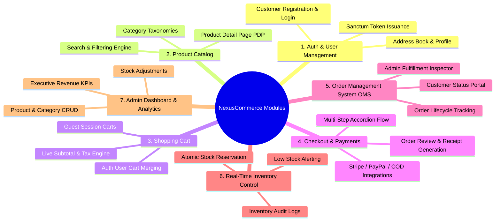
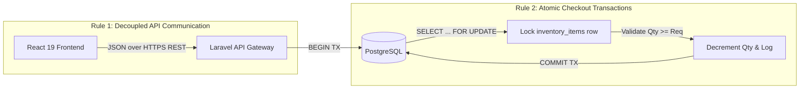

# PROJECT.md - NexusCommerce MVP Architecture & Engineering Guide

This document serves as the definitive reference for onboarding developers, AI coding assistants, and system architects working on **NexusCommerce MVP**. It answers the six foundational questions regarding the platform's architecture, conventions, and module structure.

---

## Table of Contents
1. [What is this project?](#1-what-is-this-project)
2. [What technologies are used?](#2-what-technologies-are-used)
3. [What are the main modules?](#3-what-are-the-main-modules)
4. [Where does each feature live?](#4-where-does-each-feature-live)
5. [What are the coding conventions?](#5-what-are-the-coding-conventions)
6. [What are the important architectural rules?](#6-what-are-the-important-architectural-rules)

---

## 1. What is this project?

**NexusCommerce MVP** is a modern, decoupled full-stack e-commerce web application engineered to deliver a responsive, dynamic retail shopping experience for consumers while providing comprehensive real-time store management capabilities for administrators.

### Core Objectives
* **Customer-Facing Experience**: Fast, frictionless browsing of dynamic product catalogs, seamless shopping cart manipulation, multi-step accordion checkout, and order tracking.
* **Administrative Operations**: Real-time KPI monitoring, inventory auditing, product/category management, and lifecycle order fulfillment.
* **Architectural Integrity**: Built with strict separation of concerns between a client-side Single Page Application (SPA) and a stateless RESTful backend API governed by PostgreSQL relational and JSONB storage patterns.

---

## 2. What technologies are used?

### Frontend Stack (Client SPA)
* **React 19**: Core component framework leveraging modern React concurrency features.
* **TypeScript 5+**: Enforces end-to-end compile-time type safety across UI components, API clients, and state stores.
* **Vite 6+**: High-velocity build tool and development server providing instant Hot Module Replacement (HMR).
* **Tailwind CSS v3.4+**: Utility-first CSS framework utilizing custom design tokens, glassmorphism aesthetics, and responsive dark mode styling.
* **Zustand & TanStack Query v5**: Combined client/server state management for optimistic cart updates, deduplicated API fetching, and persistent storage.
* **React Router DOM v7**: Declarative client-side routing with nested layouts and protected route guards.
* **Lucide React & React Hook Form + Zod**: Accessible vector iconography and schema-driven client-side form validation.

### Backend Stack (API Gateway & Core)
* **Laravel 11/12 (PHP 8.3+)**: Dedicated REST API backend architecture.
* **Laravel Sanctum**: Lightweight, state-aware API token management for SPAs and stateless Bearer token authentication.
* **Eloquent ORM**: Data abstraction layer configured with Strict Mode enabled (`shouldBeStrict()`) to prevent lazy loading N+1 queries and silent attribute mutations.
* **Queue Workers**: Asynchronous task workers processing email confirmations, invoice generation, and payment gateway webhook events.

### Database & Infrastructure
* **PostgreSQL 16+**: Primary relational data store utilizing UUID keys, relational foreign constraints, atomic transaction locking, and high-performance `JSONB` document storage.
* **Redis 7+**: In-memory caching engine handling session locking, API rate-limiting, and high-frequency catalog read caching.

---

## 3. What are the main modules?

The system is organized into seven distinct functional domain modules:



1. **Authentication & User Management Module**: Handles secure customer onboarding, credentials verification, Sanctum token lifecycle, password recovery, and multi-address book management (`addresses`).
2. **Product Catalog & Category Taxonomy Module**: Manages hierarchical category trees, product listings, image galleries (`product_images`), pricing tiers, and dynamic query filtering.
3. **Shopping Cart Module**: Operates dual-state guest/authenticated shopping carts (`carts`, `cart_items`) with real-time price, tax, and shipping calculations.
4. **Checkout & Payment Processing Module**: Orchestrates order creation (`orders`, `order_items`), captures immutable address snapshots, and integrates payment providers (`payments`).
5. **Order Management System (OMS) Module**: Tracks customer order fulfillment stages (`pending` -> `processing` -> `shipped` -> `delivered` -> `cancelled`).
6. **Real-Time Inventory Control Module**: Manages stock quantities (`inventory_items`), prevents concurrent overselling via database row locking, and maintains an immutable audit trail (`inventory_logs`).
7. **Admin Dashboard & Analytics Module**: Provides executive analytics, low-stock notifications, and administrative CRUD interfaces for store catalog management.

---

## 4. Where does each feature live?

The repository is structured as a monorepo containing dedicated `frontend/` and `backend/` directories.

### High-Level Directory Overview
```text
e-commerce-sample/
├── PROJECT.md                                # Architectural reference & onboarding guide (This File)
├── PROJECT_DOCUMENTATION.md                  # Comprehensive long-form technical specification
├── database_schema.sql                       # Complete PostgreSQL DDL schema & sample seed data
├── backend/e-commerce-backend/               # Laravel 11/12 REST API application
│   ├── app/
│   │   ├── Http/Controllers/Api/V1/          # Endpoints grouped by domain (Auth, Product, Cart, etc.)
│   │   ├── Http/Requests/                    # Form validation schemas & sanitization rules
│   │   ├── Models/                           # Eloquent models representing PostgreSQL tables
│   │   └── Services/                         # Domain business logic (CheckoutService, InventoryService)
│   ├── database/migrations/                  # Database structure migrations
│   └── routes/api.php                        # API Route definitions prefixed with /api/v1
└── frontend/e-commerce/                      # React 19 SPA application
    ├── src/
    │   ├── components/                       # Reusable UI components (Navbar, CartDrawer, Badge)
    │   ├── pages/                            # Application view routes (Home, PDP, Checkout, Admin)
    │   ├── services/                         # Axios / API endpoint fetchers
    │   ├── store/                            # Zustand global state stores (useCartStore, useAuthStore)
    │   └── types/                            # TypeScript interfaces matching API JSON payloads
```

### Feature-to-File Location Matrix

| Feature / Domain | Frontend UI & Pages (`frontend/e-commerce/src/`) | Frontend State & Services | Backend Controllers (`backend/e-commerce-backend/app/`) | Backend Models & Services |
| :--- | :--- | :--- | :--- | :--- |
| **User Authentication & Profile** | `pages/Auth/Login.tsx`<br>`pages/Auth/Register.tsx`<br>`pages/Customer/Profile.tsx` | `store/useAuthStore.ts`<br>`services/authApi.ts` | `Http/Controllers/Api/V1/AuthController.php`<br>`Http/Controllers/Api/V1/ProfileController.php` | `Models/User.php`<br>`Models/Address.php` |
| **Catalog & Product Browsing** | `pages/Catalog/CatalogPage.tsx`<br>`pages/Catalog/ProductDetail.tsx`<br>`components/ProductCard.tsx` | `services/productApi.ts`<br>`types/product.ts` | `Http/Controllers/Api/V1/ProductController.php`<br>`Http/Controllers/Api/V1/CategoryController.php` | `Models/Product.php`<br>`Models/Category.php`<br>`Models/ProductImage.php` |
| **Shopping Cart Operations** | `components/CartDrawer.tsx`<br>`pages/Cart/CartPage.tsx` | `store/useCartStore.ts`<br>`services/cartApi.ts` | `Http/Controllers/Api/V1/CartController.php` | `Models/Cart.php`<br>`Models/CartItem.php`<br>`Services/CartService.php` |
| **Checkout & Payments Flow** | `pages/Checkout/CheckoutPage.tsx`<br>`pages/Checkout/OrderSuccess.tsx` | `services/checkoutApi.ts`<br>`types/order.ts` | `Http/Controllers/Api/V1/CheckoutController.php` | `Models/Order.php`<br>`Models/Payment.php`<br>`Services/CheckoutService.php` |
| **Order History & OMS** | `pages/Customer/OrderHistory.tsx`<br>`pages/Customer/OrderDetail.tsx` | `services/orderApi.ts` | `Http/Controllers/Api/V1/OrderController.php` | `Models/Order.php`<br>`Models/OrderItem.php` |
| **Inventory Management** | Displayed via stock badges on `ProductCard.tsx` and `ProductDetail.tsx` | `types/inventory.ts` | Managed internally during checkout & admin adjustments | `Models/InventoryItem.php`<br>`Models/InventoryLog.php`<br>`Services/InventoryService.php` |
| **Admin Portal & Analytics** | `pages/Admin/Dashboard.tsx`<br>`pages/Admin/ProductCrud.tsx`<br>`pages/Admin/OrderInspector.tsx` | `services/adminApi.ts` | `Http/Controllers/Api/V1/Admin/DashboardController.php`<br>`Http/Controllers/Api/V1/Admin/ProductManagementController.php` | All Models + `Services/AnalyticsService.php` |

---

## 5. What are the coding conventions?

### 5.1 Frontend Conventions (React + TypeScript)
1. **Functional Components Only**: All components must be written as functional React components utilizing React 19 hooks. Class components are strictly prohibited.
2. **Strict TypeScript Enforcement**:
   - `any` is forbidden. Define explicitly typed interfaces in `src/types/` for all network request/response payloads.
   - Component props must be typed using explicit `interface ComponentProps` definitions.
3. **Styling & UI Consistency**:
   - Use Tailwind CSS utility classes exclusively. Avoid writing custom CSS files unless defining global design tokens in `index.css`.
   - Maintain visual aesthetics: utilize harmonious color schemes, smooth micro-animations (`transition-all duration-200`), and clean spacing.
4. **Form Handling & Validation**: All client-side forms must use **React Hook Form** paired with **Zod** validation schemas that mirror backend validation constraints.

### 5.2 Backend Conventions (Laravel + PHP)
1. **Strict Types & PSR-12**: All PHP files must begin with `declare(strict_types=1);` and conform strictly to PSR-12 coding standards.
2. **Thin Controllers, Fat Services**:
   - Controllers should only handle HTTP request extraction, delegation to domain services, and returning structured JSON responses.
   - Complex business logic (e.g., checkout transactions, inventory reservation, cart merging) must reside inside dedicated service classes in `app/Services/`.
3. **API Form Requests**: Never use inline `$request->validate()`. Create dedicated Form Request classes in `app/Http/Requests/` with explicit rules and custom error payloads.
4. **Eloquent Strict Mode**: Eloquent models must operate with strict mode enabled globally in `AppServiceProvider`:
   ```php
   Model::shouldBeStrict();
   ```
   This ensures immediate exceptions on unassigned mass attributes or unexpected lazy loading queries.

---

## 6. What are the important architectural rules?



### Rule 1: Strict API Decoupling
The frontend SPA and backend API are completely autonomous systems. The Laravel backend MUST NEVER return HTML views, Blade templates, or session cookies for client features. All data exchange must occur via JSON over HTTPS endpoints prefixed with `/api/v1/`.

### Rule 2: Atomic Inventory Row-Locking (Zero Overselling)
When an order is submitted to `/api/v1/checkout`, stock verification and reservation MUST execute inside an atomic PostgreSQL transaction using pessimistic locking:
```php
DB::transaction(function () use ($items) {
    foreach ($items as $item) {
        $inventory = InventoryItem::where('product_id', $item->product_id)
            ->lockForUpdate()
            ->firstOrFail();

        if ($inventory->quantity < $item->quantity) {
            throw new InsufficientStockException($item->product_id);
        }

        $inventory->decrement('quantity', $item->quantity);
        $inventory->increment('reserved_quantity', $item->quantity);
    }
});
```
*Never check stock and update quantities in separate un-isolated queries.*

### Rule 3: Immutable Address Snapshots via JSONB
When placing an order, the customer's shipping and billing coordinates MUST be serialized and stored directly inside the `orders.shipping_address` and `orders.billing_address` `JSONB` columns. Historical order records must never rely on foreign key lookups to the `addresses` table, ensuring that future address edits by a customer do not alter past invoices.

### Rule 4: Stateless Bearer Token Authorization
API requests requiring authentication must transmit a valid Laravel Sanctum token via the HTTP header:
`Authorization: Bearer <sanctum_token>`
Controllers must enforce authorization using Laravel Policies or Gate checks to guarantee that customers can only view and modify their own carts, orders, and addresses.

### Rule 5: Strict Role-Based Access Control (RBAC)
All administrative endpoints under `/api/v1/admin/*` must be guarded by middleware that verifies the authenticated user's role:
`CHECK (role = 'admin')`
Any unauthorized attempt by a `customer` role must immediately return `HTTP 403 Forbidden` without leaking system metadata.
