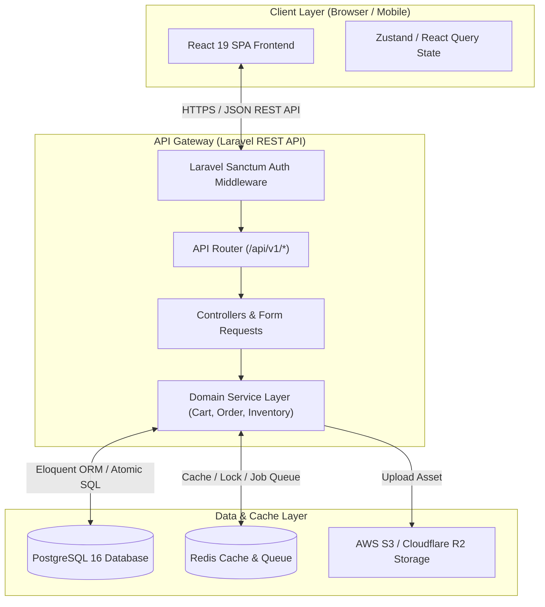
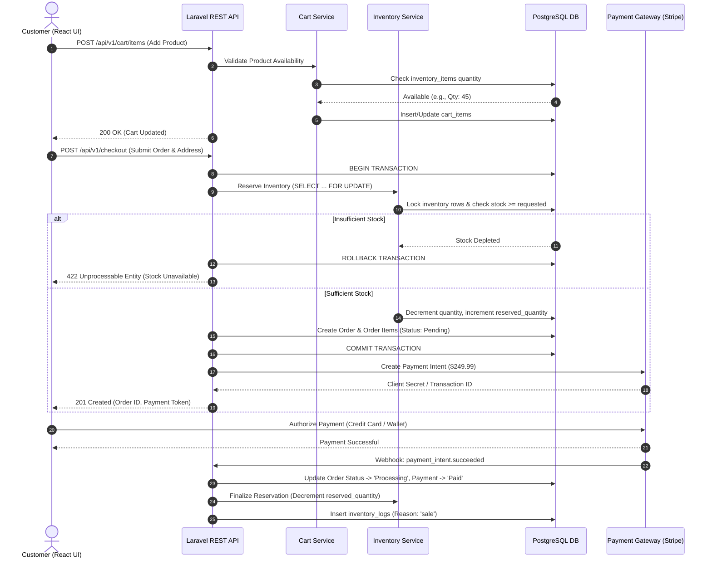
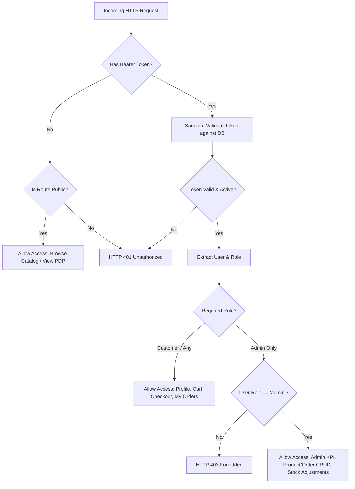
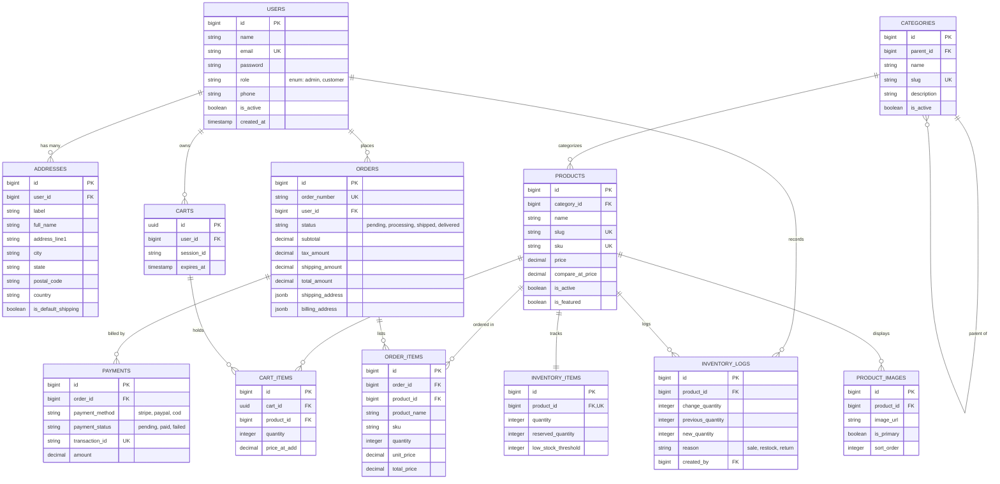

# NexusCommerce MVP
## Full-Stack E-Commerce Platform Architecture & Technical Documentation

---

| **Document Version** | 1.0.0 |
| :--- | :--- |
| **Project Name** | **NexusCommerce MVP** |
| **Frontend Stack** | React 19, TypeScript, Vite, Tailwind CSS, Lucide Icons |
| **Backend Stack** | Laravel 11/12 REST API, PHP 8.3+, Laravel Sanctum |
| **Database Engine** | PostgreSQL 16+ (Relational + JSONB support) |
| **Architecture Type** | Decoupled Single Page Application (SPA) + Stateless RESTful API |

---

## 1. Executive Summary & Project Description

**NexusCommerce MVP** is a state-of-the-art, high-performance e-commerce platform engineered to deliver a seamless, dynamic shopping experience for retail customers while providing robust, real-time store management capabilities for administrators. 

Built on a decoupled architecture comprising a responsive **React 19 single-page frontend** and an enterprise-grade **Laravel RESTful backend**, NexusCommerce enforces strict type safety, atomic inventory management, and role-based security. The platform utilizes **PostgreSQL** as its core data store, leveraging advanced relational constraints and high-performance JSONB indexing for flexible order address modeling and payment gateway metadata.

### Key Value Propositions
- **High-Velocity Shopping Experience**: Client-side routing, optimistic cart updates, and instant search filtering powered by React 19.
- **Zero Overselling Guarantee**: Atomic database row-locking (`SELECT ... FOR UPDATE`) during checkout ensures inventory consistency under concurrent order volumes.
- **Modular & Extensible API**: A clean REST API specification that readily scales to support mobile apps (React Native/iOS/Android) and third-party integrations.

---

## 2. Technology Stack & Ecosystem

### 2.1 Frontend Layer (Client Application)
* **Framework**: **React 19** with **TypeScript 5+**
* **Build System**: **Vite 6+** (Fast Hot Module Replacement and highly optimized ESBuild bundling)
* **Styling & UI**: **Tailwind CSS v3.4+** (Utility-first styling with custom design tokens, glassmorphism, and responsive dark mode design)
* **State Management**: **Zustand / TanStack Query (React Query v5)** for server state synchronization, caching, and optimistic UI updates
* **Routing**: **React Router DOM v7** (Declarative client-side navigation with nested layouts and protected route guards)
* **Icons & Assets**: **Lucide React** (Vector-based, accessible iconography)
* **Form & Validation**: **React Hook Form** + **Zod** (Schema-first client-side form validation matching backend rules)

### 2.2 Backend Layer (API Gateway & Core Logic)
* **Framework**: **Laravel 11/12 (PHP 8.3+)** configured in dedicated API mode
* **Authentication & Authorization**: **Laravel Sanctum** (State-aware API tokens for SPAs and stateless Bearer tokens for external services) + **Role-Based Access Control (RBAC)** Middleware
* **Database ORM**: **Eloquent ORM** with Strict Mode enabled (preventing lazy loading anomalies and unassignable attributes)
* **API Validation**: Form Requests with customized error payloads and automated HTTP `422 Unprocessable Entity` formatting
* **Background Jobs**: **Laravel Queue Workers** (Redis / Database backed) for asynchronous order confirmation emails, invoice PDF generation, and webhook dispatching

### 2.3 Data & Storage Layer
* **Primary Database**: **PostgreSQL 16+**
* **Caching & Session Engine**: **Redis 7+** (Distributed locking, rate-limiting, and high-frequency product catalog caching)
* **Storage Provider**: Local filesystem for dev; **AWS S3 / Cloudflare R2** for production product imagery and asset management

---

## 3. Comprehensive Feature Breakdown

### 3.1 Product Catalog
* **Dynamic Grid & List Views**: Responsive product cards featuring hover zoom, badges (e.g., *Featured*, *Low Stock*, *Sale*), and quick add-to-cart actions.
* **Advanced Search & Filtering**: Filter products instantly by Category hierarchy, Price Range, Stock Availability, and Search keyword matching against title and summary.
* **Product Detail Page (PDP)**: High-resolution image gallery carousel, comprehensive technical descriptions, stock status indicators, SKU information, and quantity selectors.

### 3.2 Shopping Cart
* **Dual-State Cart System**: Guest session UUID carts that seamlessly merge into authenticated customer carts upon login.
* **Instant Cart Operations**: Real-time quantity adjustment, item deletion, and cart clearing without full page reloads.
* **Live Price Summary**: Dynamic calculation of item subtotals, configurable tax rates, shipping fee estimates, and discount coupon applications.

### 3.3 Checkout System
* **Multi-Step Checkout Flow**: Clean, step-by-step accordion navigation handling Shipping Addresses, Billing Options, Shipping Methods, and Payment Selection.
* **Address Management**: Users can select from stored address books or add new shipping/billing addresses on the fly.
* **Payment Gateway Ready**: Built-in architecture supporting **Stripe Payment Intents**, **PayPal Commerce Platform**, and **Cash on Delivery (COD)**.
* **Order Confirmation**: Immediate confirmation screen with unique order tracking numbers (`ORD-YYYY-XXXX`) and printable receipt summaries.

### 3.4 User Accounts & Customer Portal
* **Secure Authentication**: Customer registration, secure login, password reset workflows, and session token invalidation upon logout.
* **Profile Management**: Update personal contact details, manage saved shipping/billing addresses, and view communication preferences.
* **Order History & Tracking**: Real-time status badge tracking (*Pending*, *Processing*, *Shipped*, *Delivered*, *Cancelled*) with detailed order item breakdowns.

### 3.5 Admin Dashboard & Analytics
* **Executive KPI Summary**: Visual dashboard presenting Total Revenue, Total Orders Placed, Active Customer Count, and Low Stock Alerts.
* **Product Management (CRUD)**: Full administrative control over creating, updating, activating/deactivating, and pricing products with multi-image upload capabilities.
* **Category Management (CRUD)**: Organize store taxonomies with parent-child category relations, unique SEO slugs, and category imagery.

### 3.6 Real-Time Inventory Management
* **Atomic Stock Reservation**: Decrements reserved stock immediately when an order enters checkout, preventing duplicate claims on limited items.
* **Low Stock Threshold Alerting**: Automated notifications when product stock falls below configurable safety thresholds (e.g., `< 5 items`).
* **Audit Trail & Stock Logging**: Complete historical log (`inventory_logs`) recording every restock, sale, return, or manual adjustment with administrator IDs.

### 3.7 Order Management System (OMS)
* **Order Lifecycle Control**: Admin capability to transition order statuses through the fulfillment pipeline.
* **Order Filtering & Search**: Search orders by order number, customer name, email, payment status, or date range.
* **Detailed Order Inspector**: View customer shipping coordinates, payment gateway transaction IDs, item SKUs, and administrative fulfillment notes.

---

## 4. System Flow & Architecture Diagrams

### 4.1 High-Level System Architecture



### 4.2 End-to-End Customer Checkout & Order Lifecycle



### 4.3 Role-Based Access Control (RBAC) Flow



---

## 5. Database Schema & Entity-Relationship Diagram (ERD)

The complete SQL definition is delivered in **`database_schema.sql`** located in the workspace root. Below is the Entity-Relationship structure governing NexusCommerce:



---

## 6. REST API Endpoints Specification

All endpoints are prefixed with `/api/v1` and communicate via `application/json`. Authenticated routes require the `Authorization: Bearer <sanctum_token>` header.

### 6.1 Authentication & Profile (`/api/v1/auth`)
| HTTP Method | Endpoint | Access | Description |
| :--- | :--- | :--- | :--- |
| `POST` | `/auth/register` | Public | Register new customer account and return Sanctum token |
| `POST` | `/auth/login` | Public | Authenticate user credentials and return Sanctum token |
| `POST` | `/auth/logout` | Authenticated | Revoke current access token |
| `GET` | `/auth/me` | Authenticated | Retrieve profile details of authenticated user |
| `PUT` | `/auth/profile` | Authenticated | Update user name, phone, or password |

### 6.2 Product Catalog (`/api/v1/products` & `/categories`)
| HTTP Method | Endpoint | Access | Description |
| :--- | :--- | :--- | :--- |
| `GET` | `/categories` | Public | List active categories with hierarchy tree |
| `GET` | `/products` | Public | Paginated product listing with filters (`category`, `min_price`, `search`, `sort`) |
| `GET` | `/products/{slug}` | Public | Get detailed product information including images and live inventory status |

### 6.3 Shopping Cart (`/api/v1/cart`)
| HTTP Method | Endpoint | Access | Description |
| :--- | :--- | :--- | :--- |
| `GET` | `/cart` | Public / Customer | Get active cart items, quantity, subtotal, and tax estimates |
| `POST` | `/cart/items` | Public / Customer | Add item to cart (`product_id`, `quantity`) |
| `PUT` | `/cart/items/{id}` | Public / Customer | Update quantity of a specific cart item |
| `DELETE` | `/cart/items/{id}` | Public / Customer | Remove item from cart |
| `DELETE` | `/cart` | Public / Customer | Empty cart contents |

### 6.4 Checkout & Orders (`/api/v1/checkout` & `/orders`)
| HTTP Method | Endpoint | Access | Description |
| :--- | :--- | :--- | :--- |
| `POST` | `/checkout` | Authenticated | Submit order, reserve stock, and generate payment gateway token |
| `GET` | `/orders` | Customer | List paginated order history for authenticated customer |
| `GET` | `/orders/{order_number}` | Customer | View specific order status, item breakdown, and tracking number |

### 6.5 Admin Management Portal (`/api/v1/admin`)
| HTTP Method | Endpoint | Access | Description |
| :--- | :--- | :--- | :--- |
| `GET` | `/admin/metrics` | Admin | Retrieve KPI dashboard analytics (Revenue, Orders, Low Stock count) |
| `GET` | `/admin/products` | Admin | List all products including inactive items |
| `POST` | `/admin/products` | Admin | Create a new product with initial inventory allocation |
| `PUT` | `/admin/products/{id}` | Admin | Update product metadata, pricing, or active status |
| `POST` | `/admin/inventory/{product_id}/adjust` | Admin | Manual stock adjustment (`change_quantity`, `reason`) |
| `GET` | `/admin/orders` | Admin | List system-wide orders with status filter |
| `PATCH` | `/admin/orders/{id}/status` | Admin | Update order status (`processing`, `shipped`, `delivered`) and assign tracking |

---

## 7. Security, Compliance & Performance Engineering

### 7.1 Security Enforcement
1. **Input Validation & Sanitization**: Every API request is checked through strict Laravel Form Requests (`Zod` validation on frontend). SQL injection is eliminated via Eloquent parameterized query bindings.
2. **CSRF & CORS Protection**: CORS configured exclusively for trusted frontend origins (`http://localhost:5173`, production domains). CSRF tokens validated for cookie-based sessions.
3. **Password Security**: Passwords hashed securely using **Bcrypt (cost factor 12)** or Argon2id.
4. **Row-Level Security (RLS) / Tenant Isolation**: Customers can only query or modify their own order histories and carts via controller authorization policies.

### 7.2 Database Concurrency & Performance
* **Atomic Locking**: Checkout transactions execute `DB::transaction()` with pessimistic locking (`sharedLock` or `lockForUpdate`) on `inventory_items` to guarantee zero stock overselling under heavy load.
* **Indexed Queries**: Foreign keys, search slugs, SKUs, and filtering columns (`role`, `status`, `is_active`) are fully indexed in PostgreSQL.
* **JSONB Storage**: Order shipping and billing addresses are captured as immutable `JSONB` snapshots at the time of purchase, insulating historical order records from future user profile address changes.

---

## 8. Directory & Project Structure Guide

```text
e-commerce-sample/
├── PROJECT_DOCUMENTATION.md          # Complete Technical Specification & Architecture Guide (This File)
├── database_schema.sql               # Production PostgreSQL DDL Schema & Seed Data
├── backend/
│   └── e-commerce-backend/           # Laravel 11/12 REST API Codebase
│       ├── app/
│       │   ├── Http/Controllers/Api/V1/ # Auth, Product, Cart, Checkout, Order Controllers
│       │   ├── Http/Requests/           # Form Validation Request Classes
│       │   ├── Models/                  # Eloquent Models (User, Product, Order, InventoryItem)
│       │   └── Services/                # Domain Business Logic (CheckoutService, InventoryService)
│       ├── database/migrations/         # Laravel Schema Migrations matching database_schema.sql
│       └── routes/api.php               # API v1 Route Definitions
└── frontend/
    └── e-commerce/                   # React 19 + Vite + Tailwind CSS Application
        ├── public/
        └── src/
            ├── components/              # UI Components (Navbar, ProductCard, CartDrawer, Badge)
            ├── pages/                   # Route Pages (Home, Catalog, PDP, Cart, Checkout, Admin)
            ├── services/                # Axios / Fetch API Clients & Endpoints
            ├── store/                   # Zustand Global State Stores
            └── types/                   # TypeScript Interfaces matching Backend API Payloads
```
