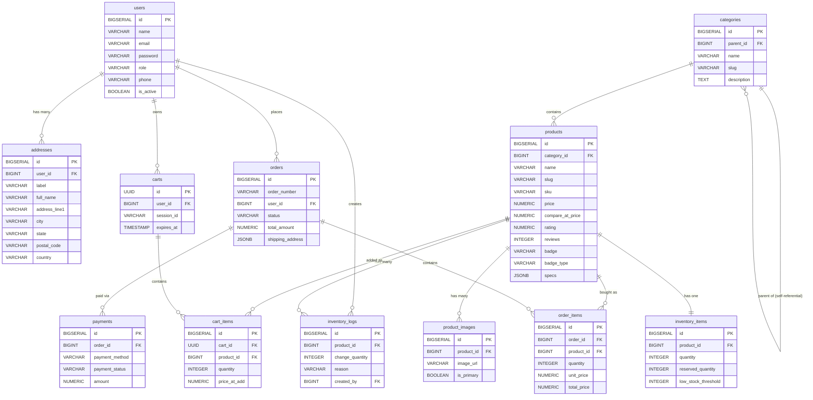

# Database Schema Documentation

This document provides a comprehensive overview of the PostgreSQL database schema for the NexusCommerce MVP. It includes an Entity-Relationship Diagram (ERD) and detailed descriptions of each table and its columns.

## Entity-Relationship Diagram (ERD)

## Table Documentation

### 1. `users`
Core table storing authentication and profile information for all users (customers and administrators).
- `id`: Primary Key.
- `name`: Full name of the user.
- `email`: Unique email address used for login.
- `email_verified_at`: Timestamp for when the user verified their email.
- `password`: Hashed password.
- `role`: Role of the user (`admin` or `customer`). Defaults to `customer`.
- `phone`: Optional contact phone number.
- `avatar_url`: Optional profile picture URL.
- `remember_token`: Token for "remember me" sessions.
- `is_active`: Boolean flag indicating if the account is active/unbanned.
- `created_at` / `updated_at`: Standard audit timestamps.

### 2. `addresses`
Stores multiple addresses for users to use during checkout.
- `id`: Primary Key.
- `user_id`: Foreign Key linking to `users.id`.
- `label`: Friendly identifier for the address (e.g., "Home", "Office").
- `full_name`: The recipient's name.
- `phone`: Contact number for delivery purposes.
- `address_line1` / `address_line2`: Street address details.
- `city` / `state` / `postal_code` / `country`: Geographic details.
- `is_default_shipping`: Boolean flag indicating if this is the user's default shipping choice.
- `is_default_billing`: Boolean flag indicating if this is the user's default billing choice.

### 3. `categories`
Organizes products into logical groupings. Supports hierarchical nesting via `parent_id`.
- `id`: Primary Key.
- `parent_id`: Foreign Key linking to another category (self-referential) for nested sub-categories.
- `name`: Display name of the category (e.g., "Hoodies & Outerwear").
- `slug`: URL-friendly identifier used in routes.
- `description`: Textual description for category pages or SEO.
- `image_url`: Optional banner image for the category page.
- `is_active`: Toggle visibility.
- `sort_order`: Controls manual sorting in navigation menus.

### 4. `products`
The main catalog table. Stores all primary metadata that maps exactly to the frontend `Product` interface.
- `id`: Primary Key.
- `category_id`: Foreign Key linking to `categories.id`.
- `name`: Name of the product.
- `slug`: URL-friendly identifier used in product routes.
- `sku`: Unique Stock Keeping Unit for inventory matching.
- `summary`: Short summary of the product.
- `description`: Full HTML/Markdown description.
- `price`: Current selling price.
- `compare_at_price`: Original/higher price for displaying discounts.
- `cost_price`: Internal cost for profit margin calculation.
- `rating`: Numeric aggregate rating (e.g., 4.9).
- `reviews`: Total count of reviews received.
- `badge`: Promotional text to display on the product card (e.g., "15% OFF", "NEW ARRIVAL").
- `badge_type`: The visual style of the badge (`sale`, `low_stock`, `featured`).
- `specs`: A JSONB array of `{label, value}` objects (e.g., `[{"label": "Fit", "value": "Oversized"}]`).
- `is_active`: Controls visibility on the storefront.
- `is_featured`: Marks product to show in hero sections.

### 5. `product_images`
One-to-many table for handling product media galleries.
- `id`: Primary Key.
- `product_id`: Foreign Key linking to `products.id`.
- `image_url`: Path or CDN link to the image.
- `alt_text`: Accessibility description for screen readers.
- `is_primary`: Flag denoting the main thumbnail image.
- `sort_order`: Display order in the gallery carousel.

### 6. `inventory_items`
Holds real-time stock levels separated from the `products` table to reduce locking contention during high-traffic checkouts.
- `id`: Primary Key.
- `product_id`: Foreign Key linking to `products.id` (Unique, 1-to-1 relationship).
- `quantity`: Total units physically available.
- `reserved_quantity`: Units currently locked in pending checkouts but not yet paid.
- `low_stock_threshold`: The point at which admins are alerted to restock.

### 7. `inventory_logs`
An append-only audit trail logging every single change in stock levels.
- `id`: Primary Key.
- `product_id`: Foreign Key linking to `products.id`.
- `change_quantity`: Positive or negative integer of the delta.
- `previous_quantity` / `new_quantity`: State snapshots for fast auditing.
- `reason`: Explanation enum (`restock`, `sale`, `return`, `manual`, `adjustment`, `reservation_expired`).
- `note`: Optional text from admins for manual adjustments.
- `created_by`: Foreign Key linking to the `users.id` who made the change.

### 8. `carts` & 9. `cart_items`
Manages shopping sessions.
- **`carts`**:
  - `id`: UUID Primary Key.
  - `user_id`: Foreign Key linking to `users.id` (nullable for guests).
  - `session_id`: Session token for tracking anonymous users.
  - `expires_at`: Timestamp determining when abandoned carts are cleared.
- **`cart_items`**:
  - `id`: Primary Key.
  - `cart_id`: Foreign Key linking to `carts.id`.
  - `product_id`: Foreign Key linking to `products.id`.
  - `quantity`: Number of items added.
  - `price_at_add`: The snapshot of the price when it was added to the cart to warn users if prices change.

### 10. `orders`
The single source of truth for a finalized purchase.
- `id`: Primary Key.
- `order_number`: Unique human-readable string (e.g., `ORD-2026-8892`).
- `user_id`: Foreign Key linking to `users.id`.
- `status`: Enum (`pending`, `processing`, `shipped`, `delivered`, `cancelled`, `refunded`).
- `subtotal` / `tax_amount` / `shipping_amount` / `discount_amount` / `total_amount`: Financial breakdown.
- `shipping_address` / `billing_address`: JSONB snapshot of the address at the time of purchase.
- `shipping_method`: Selected delivery provider.
- `tracking_number`: Courier tracking ID.
- `customer_notes` / `admin_notes`: Additional instructions.
- `shipped_at` / `delivered_at` / `cancelled_at`: Lifecycle timestamps.

### 11. `order_items`
The individual items locked into a completed order.
- `id`: Primary Key.
- `order_id`: Foreign Key linking to `orders.id`.
- `product_id`: Foreign Key linking to `products.id`.
- `product_name` / `sku`: Hard snapshots of the product details in case the product is later deleted or renamed.
- `quantity`: Number purchased.
- `unit_price` / `total_price`: Frozen snapshot of financial totals.

### 12. `payments`
Tracks transactions attached to orders.
- `id`: Primary Key.
- `order_id`: Foreign Key linking to `orders.id`.
- `payment_method`: Enum (`stripe`, `paypal`, `cod`, `bank_transfer`).
- `payment_status`: Enum (`pending`, `authorized`, `captured`, `paid`, `failed`, `refunded`).
- `transaction_id`: Third-party payment gateway transaction reference.
- `amount` / `currency`: Financials.
- `payment_gateway_response`: JSONB dump of the webhook payload for debugging.
- `paid_at`: Completion timestamp.
