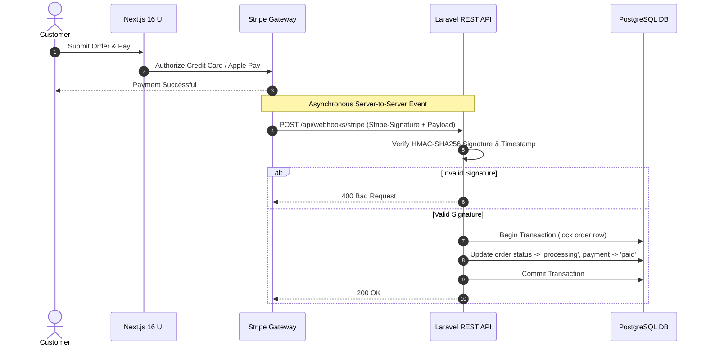

# Lesson 8: Stripe Payment Gateway Webhooks & Signature Verification

Welcome to the advanced e-commerce engineering series. In this lesson, we tackle a mission-critical component of production e-commerce systems: **Payment Gateway Webhooks**.

---

## 1. The Core Problem: Why Client-Side Redirects Fail

In naive implementations, developers often mark an order as "paid" when the customer returns to a frontend redirect URL (e.g., `/checkout/success?session_id=cs_123`):

```text
Customer Browser ───> Stripe Checkout ───> Redirect to /checkout/success ───> Frontend calls API to mark Paid
```

### Why this is dangerous:
1. **Network Drops & Tab Closes**: If the customer closes their browser tab, loses mobile connectivity, or experiences a crash immediately after paying, the redirect never fires. The customer was charged, but your database still marks the order as `pending`.
2. **Client-Side Spoofing**: If your API has an endpoint like `POST /api/orders/{id}/mark-paid` that the frontend calls, any malicious user can call it directly with a forged payload and receive items without paying.

### The Solution: Webhooks (Server-to-Server Truth)
A **Webhook** is an automated, asynchronous HTTP POST request sent directly from Stripe's servers to your Laravel API backend (`POST /api/webhooks/stripe`).



---

## 2. The 4 Golden Rules of Webhook Architecture

### Rule 1: Never Use `auth:sanctum` on Webhooks
Stripe's webhook delivery servers do not have an authenticated user session or customer Bearer token. The webhook route MUST be accessible without user authentication.

### Rule 2: Non-Negotiable HMAC SHA-256 Signature Verification
Because the webhook endpoint is public, anyone can attempt to POST arbitrary JSON payloads. You must verify the `Stripe-Signature` header against your `STRIPE_WEBHOOK_SECRET`.

### Rule 3: Replay Attack Defense (Timestamp Tolerance)
Stripe prefixes its signature with a Unix timestamp (`t=1741234567,v1=...`). Verify that `abs(time() - $timestamp) <= 300` (5 minutes) so attackers cannot capture a valid historical request and replay it later.

### Rule 4: Decouple via Events & Listeners
A webhook controller should:
1. Validate the signature.
2. Dispatch a `PaymentReceived` event.
3. Return `HTTP 200 OK` promptly (within 2-3 seconds).

All heavy work (updating database records, notifying warehouse, sending receipts) must be executed by dedicated Listeners or background Queue Jobs.

---

## 3. Detailed Implementation Guide

### Step 1: Configuration & Environment Setup

Add the Stripe webhook secret to your environment and configuration:

In `.env`:
```env
STRIPE_SECRET_KEY=sk_test_...
STRIPE_WEBHOOK_SECRET=whsec_...
```

In `config/services.php`:
```php
'stripe' => [
    'secret' => env('STRIPE_SECRET_KEY'),
    'webhook_secret' => env('STRIPE_WEBHOOK_SECRET'),
],
```

---

### Step 2: The Event (`app/Events/PaymentReceived.php`)

Create the event class to carry the validated payment details across the system:

```bash
php artisan make:event PaymentReceived
```

```php
declare(strict_types=1);

namespace App\Events;

use Illuminate\Foundation\Events\Dispatchable;
use Illuminate\Queue\SerializesModels;

class PaymentReceived
{
    use Dispatchable, SerializesModels;

    /**
     * @param array<string, mixed> $payload
     */
    public function __construct(
        public string $orderNumber,
        public string $transactionId,
        public float $amount,
        public string $currency,
        public array $payload = []
    ) {}
}
```

---

### Step 3: The Listener (`app/Listeners/UpdateOrderStatusToPaid.php`)

Create the listener responsible for updating the `orders` and `payments` tables atomically:

```bash
php artisan make:listener UpdateOrderStatusToPaid --event=PaymentReceived
```

```php
declare(strict_types=1);

namespace App\Listeners;

use App\Events\PaymentReceived;
use App\Models\Order;
use App\Models\Payment;
use Illuminate\Support\Facades\DB;

class UpdateOrderStatusToPaid
{
    /**
     * Handle the event.
     */
    public function handle(PaymentReceived $event): void
    {
        DB::transaction(function () use ($event) {
            // Pessimistic lock to prevent race conditions
            $order = Order::where('order_number', $event->orderNumber)
                ->lockForUpdate()
                ->first();

            if (! $order) {
                return;
            }

            // Update Order status
            $order->update([
                'status' => 'processing',
            ]);

            // Create or update Payment record
            Payment::updateOrCreate(
                ['order_id' => $order->id],
                [
                    'payment_method' => 'stripe',
                    'payment_status' => 'paid',
                    'transaction_id' => $event->transactionId,
                    'amount' => $event->amount,
                    'currency' => $event->currency,
                    'payment_gateway_response' => $event->payload,
                    'paid_at' => now(),
                ]
            );
        });
    }
}
```

---

### Step 4: The Controller (`app/Http/Controllers/WebhookController.php`)

This controller receives the raw HTTP request, verifies Stripe's signature, and dispatches the event:

```bash
php artisan make:controller WebhookController
```

```php
declare(strict_types=1);

namespace App\Http\Controllers;

use App\Events\PaymentReceived;
use Illuminate\Http\JsonResponse;
use Illuminate\Http\Request;

class WebhookController extends Controller
{
    public function handleStripeWebhook(Request $request): JsonResponse
    {
        $signatureHeader = $request->header('Stripe-Signature');
        $rawPayload = $request->getContent();
        $webhookSecret = (string) config('services.stripe.webhook_secret');

        // 1. Ensure required inputs are present
        if (! $signatureHeader || empty($webhookSecret)) {
            return response()->json(['error' => 'Missing signature or webhook secret configuration'], 400);
        }

        // 2. Parse timestamp (t) and signature (v1) from Stripe-Signature header
        $signatureData = $this->parseSignatureHeader($signatureHeader);
        if (! isset($signatureData['t'], $signatureData['v1'])) {
            return response()->json(['error' => 'Invalid signature header format'], 400);
        }

        // 3. Tolerance check (reject requests older than 5 minutes to prevent replay attacks)
        if (abs(time() - (int) $signatureData['t']) > 300) {
            return response()->json(['error' => 'Webhook timestamp expired'], 400);
        }

        // 4. Compute expected HMAC-SHA256 signature
        $signedPayload = $signatureData['t'] . '.' . $rawPayload;
        $expectedSignature = hash_hmac('sha256', $signedPayload, $webhookSecret);

        // Constant-time string comparison to prevent timing attacks
        if (! hash_equals($expectedSignature, $signatureData['v1'])) {
            return response()->json(['error' => 'Signature verification failed'], 400);
        }

        // 5. Decode payload and process target events
        $event = json_decode($rawPayload, true);
        if (($event['type'] ?? '') === 'payment_intent.succeeded') {
            $paymentIntent = $event['data']['object'];

            $orderNumber = $paymentIntent['metadata']['order_number'] ?? null;
            $transactionId = $paymentIntent['id'] ?? null;
            $amount = isset($paymentIntent['amount']) ? ((float) $paymentIntent['amount']) / 100 : 0.0;
            $currency = strtoupper((string) ($paymentIntent['currency'] ?? 'USD'));

            if ($orderNumber && $transactionId) {
                PaymentReceived::dispatch(
                    $orderNumber,
                    $transactionId,
                    $amount,
                    $currency,
                    $event
                );
            }
        }

        return response()->json(['status' => 'success'], 200);
    }

    /**
     * Parse the Stripe-Signature header into an associative array.
     * Example input: "t=1741234567,v1=abc123def456"
     *
     * @return array<string, string>
     */
    protected function parseSignatureHeader(string $header): array
    {
        $items = explode(',', $header);
        $result = [];

        foreach ($items as $item) {
            $parts = explode('=', trim($item), 2);
            if (count($parts) === 2) {
                $result[$parts[0]] = $parts[1];
            }
        }

        return $result;
    }
}
```

---

### Step 5: Register the Route (`routes/api.php`)

Add the webhook endpoint outside the `auth:sanctum` group:

```php
use App\Http\Controllers\WebhookController;

// Public webhook listener
Route::post('/webhooks/stripe', [WebhookController::class, 'handleStripeWebhook']);
```

---

## 4. Writing Feature Tests with Pest

In accordance with our TDD rule, create `tests/Feature/StripeWebhookTest.php`:

```bash
php artisan make:test --pest StripeWebhookTest
```

```php
use App\Events\PaymentReceived;
use App\Models\Order;
use App\Models\Payment;
use Illuminate\Support\Facades\Event;

test('rejects webhook with missing signature', function () {
    $response = $this->postJson('/api/webhooks/stripe', [
        'type' => 'payment_intent.succeeded',
    ]);

    $response->assertStatus(400)
        ->assertJson(['error' => 'Missing signature or webhook secret configuration']);
});

test('rejects webhook with invalid signature', function () {
    config(['services.stripe.webhook_secret' => 'whsec_test_secret']);

    $timestamp = time();
    $payload = json_encode(['type' => 'payment_intent.succeeded']);

    $response = $this->call(
        'POST',
        '/api/webhooks/stripe',
        [],
        [],
        [],
        [
            'HTTP_STRIPE_SIGNATURE' => "t={$timestamp},v1=forged_signature_string",
            'CONTENT_TYPE' => 'application/json',
        ],
        $payload
    );

    $response->assertStatus(400)
        ->assertJson(['error' => 'Signature verification failed']);
});

test('accepts valid stripe signature and dispatches PaymentReceived event', function () {
    Event::fake([PaymentReceived::class]);
    config(['services.stripe.webhook_secret' => 'whsec_test_secret']);

    $timestamp = time();
    $payload = json_encode([
        'type' => 'payment_intent.succeeded',
        'data' => [
            'object' => [
                'id' => 'pi_test_987654321',
                'amount' => 18500, // $185.00
                'currency' => 'usd',
                'metadata' => [
                    'order_number' => 'ORD-2026-TEST',
                ],
            ],
        ],
    ]);

    $signature = hash_hmac('sha256', $timestamp . '.' . $payload, 'whsec_test_secret');

    $response = $this->call(
        'POST',
        '/api/webhooks/stripe',
        [],
        [],
        [],
        [
            'HTTP_STRIPE_SIGNATURE' => "t={$timestamp},v1={$signature}",
            'CONTENT_TYPE' => 'application/json',
        ],
        $payload
    );

    $response->assertStatus(200)
        ->assertJson(['status' => 'success']);

    Event::assertDispatched(PaymentReceived::class, function (PaymentReceived $event) {
        return $event->orderNumber === 'ORD-2026-TEST'
            && $event->transactionId === 'pi_test_987654321'
            && $event->amount === 185.0
            && $event->currency === 'USD';
    });
});
```

---

## 5. Summary Checklist

- [x] Route created outside `auth:sanctum`.
- [x] CSRF exempt (default for `routes/api.php` in Laravel).
- [x] HMAC SHA-256 signature verification implemented with constant-time check (`hash_equals`).
- [x] 5-minute timestamp tolerance check implemented.
- [x] `PaymentReceived` event decoupled from controller logic.
- [x] `UpdateOrderStatusToPaid` listener updates `Order` and `Payment` tables within a pessimistic transaction.
- [x] Pest feature tests written covering missing signatures, tampered signatures, and successful processing.
